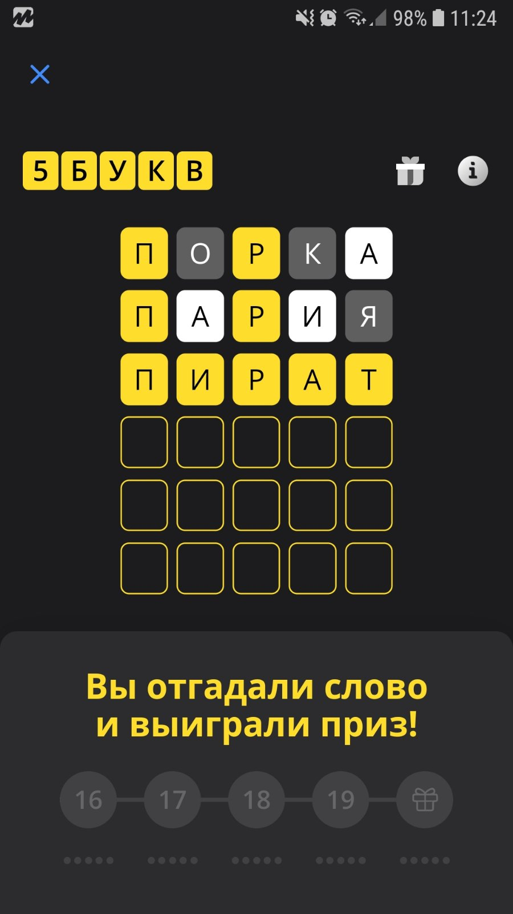

# Игра "5 Букв" (Wordle)

Тинькофф перезапустил игру "5 букв", в которой нужно отгадывать слова. Вам нужно набрать существительное из пяти букв, система покажет какие буквы этого слова есть в загаданном слове, на основе этой информации вы должны отгадать слово за несколько попыток.  

   

В блокное Jupyter на основе анализа существующих слов ищется наиболее подходящее начальное слово для игры.
